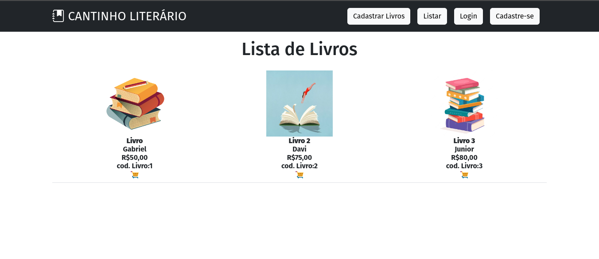
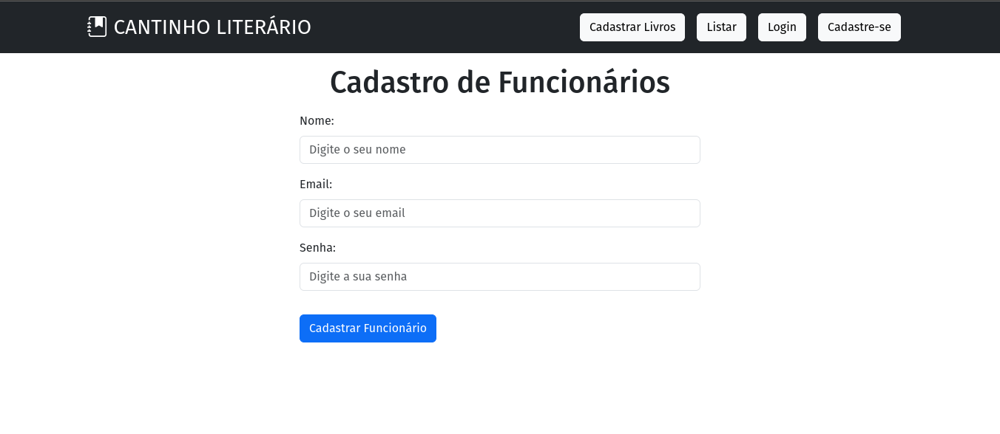
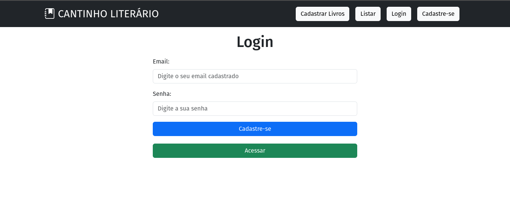
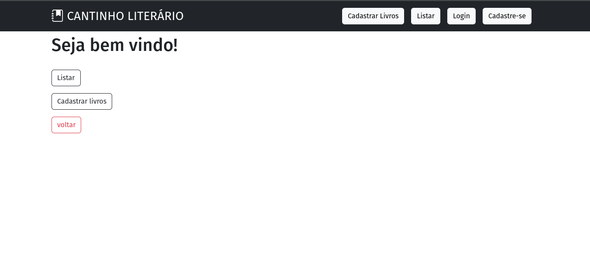
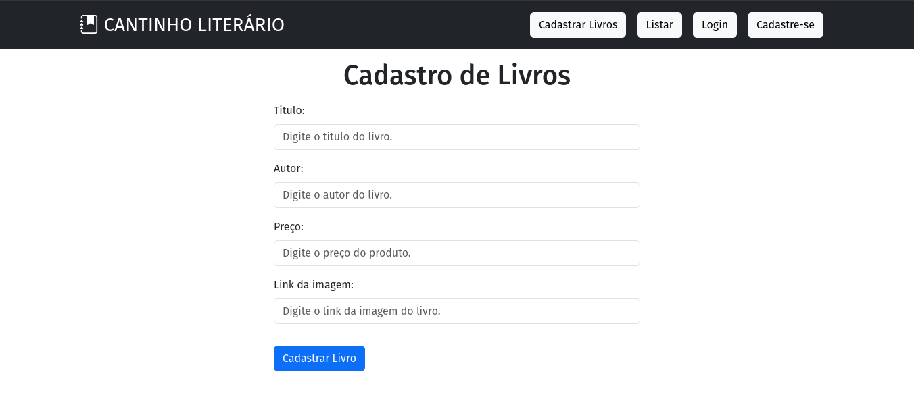

### Orientações:

- Crie uma API chamada API_LIVRARIA com os models:
    - Funcionario(
        1. id_funcionario integer,chave primária,
        2. nome string,
        3. email string,
        4. senha string.
    - livros(
        1. id_livro integer, chave primária,
        2. Titulo string,
        3. autor string,
        4. preco string.
        5. link imagem(utilize o link da imagem na web para cadastro, conforme nossa atividade da semana 4)
    - Crie uma aplicação que consuma sua API e faça login no sistema e realize cadastro de livros.
    - Não será necessário colocar as opções de update e deletar para o funcionário e livros.

## Projeto em execução

 

## Cadastro de Funcionário 

 

## Login  

 

## Logado 

 

## Cadastro de Livros  

