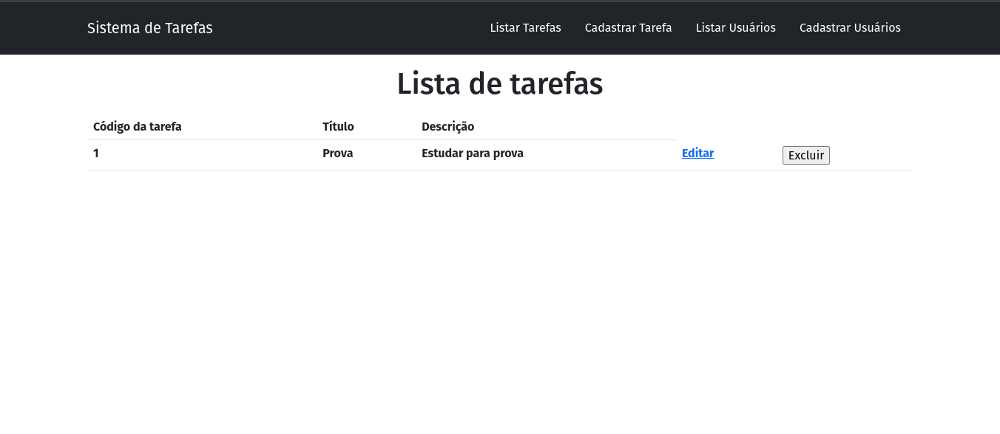

### Orientações:

- Na aplicação da semana, crie a view listar e cadastrar usuario, suas rotas e seus services para acesso a  API também criada na semana.
- Você deverá utilizar a aplicação da semana e consumir a API criada também na semana.
- Não será necessário colocar as opções de update e deletar para o usuário.

## Projeto em execução

 

## Cadastro de Tarefas

 

## Listar Usuários

 

## Cadastro Usuários 

