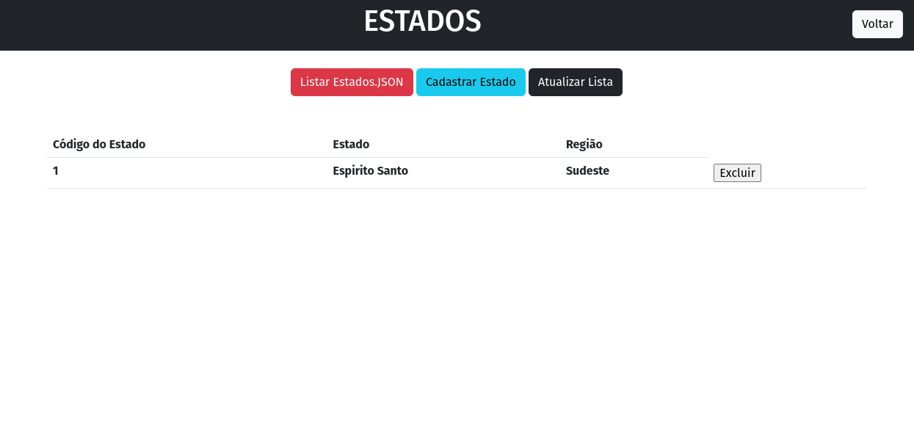
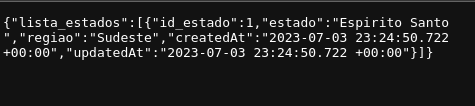

### Orientações:

- Crie um projeto que retorne a lista de Estados via lista. Aplicação deve conter um formulário para cadastro dos estados na lista e um retorno via json do estado cadastrado.

## Projeto em execução

 

## Lista de estados em JSON

