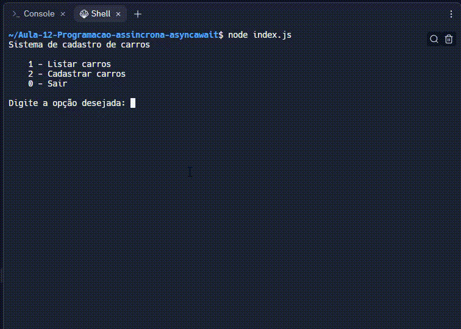

Nesta tarefa você deverá fazer um sistema em JavaScript, utilizando Node.js, que dê ao usuário 3 opções:

1 - Listar carros  
2 - Cadastrar novo carro  
3 - Sair do sistema  

- Cada carro deve ter as seguintes características: Placa, Nome e Montadora.

- Você deve salvar os dados dos carros em um arquivo JSON.

- Para listar os carros cadastrados, você deve fazer a leitura desse mesmo arquivo.

- Para fazer a escrita e leitura do arquivo criado, use somente as funções assíncronas disponibilizadas pelo módulo fs (funções que não terminam com Sync)

Atenção!

Para as funcionalidades 1 e 2 do sistema, crie funções que retornam uma Promise. Você deve tratar o retorno dessas funções com o async/await.

Observe abaixo um exemplo do comportamento do sistema:

## Tecnologias utilizadas  

1. JavaScript 
2. NodeJS

 

[Visualizar Projeto](https://replit.com/@GabrielMorozini/cadastrocarros?v=1)

 

  
  
     

