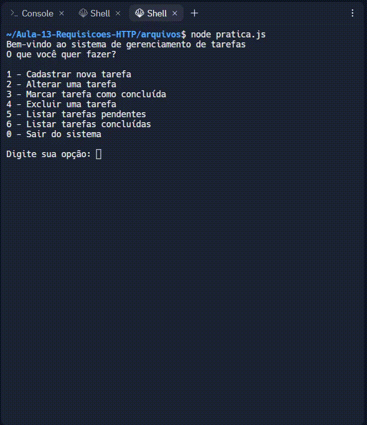

Olá! Nesta atividade você construirá um sistema em JavaScript, utilizando Node.js, que faça o gerenciamento de tarefas de uma pessoa, de forma que o usuário, ao acessar o sistema, obtenha as seguintes opções:

1 - Cadastrar nova tarefa;

2 - Alterar uma tarefa;

3 - Marcar tarefa como concluída;

4 - Excluir uma tarefa;

5 - Listar tarefas pendentes;

6 - Listar tarefas concluídas;

0 - Sair do sistema.

Cada tarefa deverá possuir os seguintes atributos: {id, descricao, status}.

Na opção 1, ao cadastrar uma tarefa, o usuário deverá informar um ID e a descrição da tarefa. No momento do cadastro, a tarefa deve ser cadastrada com o status "Pendente" automaticamente.

Na opção 2, o único atributo da tarefa que poderá ser alterado é a descrição.

Na opção 3 o usuário deverá informar o ID de uma tarefa e ela deve ter seu status alterado para "Concluída".

Na opção 4 o usuário pode excluir uma tarefa, esteja ela Pendente ou Concluída.

Na opção 5 o sistema deverá imprimir na tela somente as tarefas que estejam com o status Pendente.

Na opção 6 o sistema deverá imprimir na tela somente as tarefas que estejam com o status Concluída.

Na opção 0 o sistema deve enviar uma mensagem de despedida e encerrar a sua execução.

Informações sobre o desenvolvimento
Esta atividade deverá ser desenvolvida no repl.it. Lá você encontrará a Atividade Prática da Semana 4;
Você deverá armazenar as tarefas no arquivo db.json

Para cadastrar, alterar, consultar e excluir tarefas, você deve usar o axios para fazer as requisições correspondentes a estas operações;

Para levantar um servidor web que retorne o arquivo JSON, use o módulo json-server, como foi mostrado nas aulas. 

Observe abaixo um exemplo do comportamento do sistema:

## Tecnologias utilizadas  

1. JavaScript 
2. NodeJS

 

[Visualizar Projeto](https://replit.com/@GabrielMorozini/gerenciamentotarefas?v=1) 

OBS.: as ações não serão concluidas e irão retornar "erro", uma vez que o servidor precisa ser iniciado manualmente para que o projeto funcione corretamente

 

  
  
     

