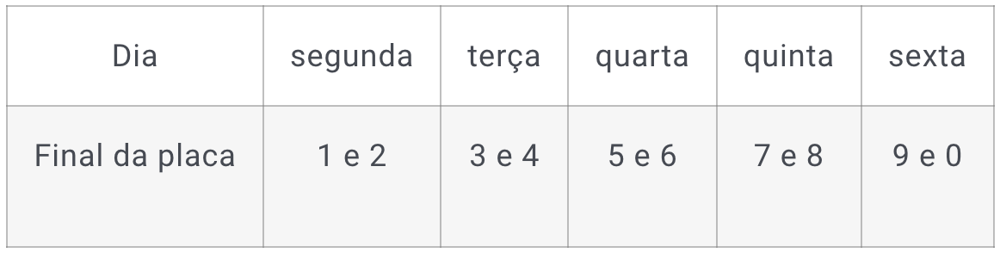

1- Com base nas informações abaixo sobre o rodízio de veículos, faça um programa em JavaScript, utilizando o Node.js, que receba via linha de comando a placa de um determinado veículo e, baseado no dia da semana em que o programa está sendo executado, determine se esse veículo pode ou não estar em circulação. Para obter o dia da semana, pesquise sobre a classe Date do JavaScript.

O rodízio SP pode parecer um pouco assustador à primeira vista, mas fique tranquilo, a regra para veículos em circulação é bem simples.

A restrição da circulação de carros é feita de acordo com o final da placa do veículo e vale de segunda a sexta-feira. Sendo assim, durante um dia por semana, cada veículo é proibido de circular no centro expandido durante seis horas, na parte da manhã e final da tarde. 

A restrição de circulação é feita de acordo com a tabela abaixo:

2- Faça um programa em JavaScript utilizando o Node.js que receba, via linha de comando, uma data no formato DD/MM/AAAA, e em seguida escreva essa data por extenso. Por exemplo, se a entrada for "11/01/2023", a saída deve ser "11 de janeiro de 2023".

3- Faça um programa em JavaScript, utilizando o Node.js que receba dois números via terminal e faça a divisão do primeiro com o segundo número. Se o segundo número for 0, o programa não pode fazer o cálculo e deve avisar ao usuário que houve o erro "Divisão por zero". Para isso, você deve usar o tratamento de exceções (try...catch) para capturar o erro e informar ao usuário.

4- Escreva um arquivo JSON manualmente com os seguintes dados de pessoas fictícias: Nome completo, Endereço, Nacionalidade, Idade e Sexo. O arquivo deve ter os dados de, no mínimo, 10 pessoas. Após isso, em um programa feito em JavaScript utilizando o Node.js, converta esse arquivo JSON que você acabou de criar em um array e imprima-o na tela.

## Tecnologias utilizadas  

1. JavaScript 
2. NodeJS

 

[Visualizar Projeto](https://replit.com/@GabrielMorozini/rodizio?v=1)

 

  
  
     

