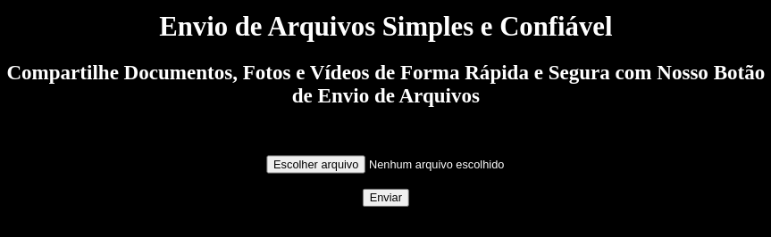

Você deve criar um Servidor Web em Node que ofereça o serviço de envio de arquivos, com as seguintes funcionalidades:

1 - Crie uma página principal (que será lida) em HTML com título e subtítulo. Apresente a opção de seleção e envio de arquivos.

- Adicione CSS à página, mude a cor de fundo e a cor da fonte, pelo menos.

2 - Faça a leitura desse arquivo (HTML).

3 - Crie o serviço de envio (upload) de arquivos (fotos e documentos).

4 - Liste o(s) arquivo(s) enviado(s) na pasta de upload do servidor (somente pasta "raiz"). Utilize a ajuda do código: (Codificação) - Listar arquivos da pasta.

- A leitura do arquivo será exibida no console.

## Tecnologias utilizadas  

1. JavaScript 
2. NodeJS
3. HTML
4. CSS

 

 

  
  
     

