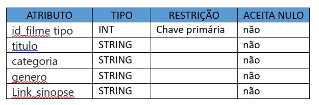
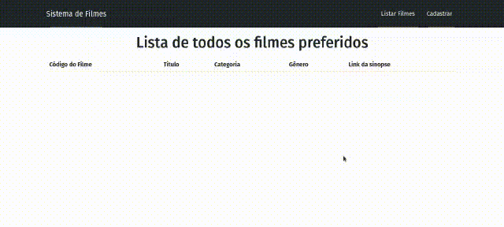

Instruções:

- Utilizando o padrão MVC, o banco de dados sqlite, ORM sequelize, express e bootstrap faça a criação de uma aplicação para armazenar a lista de seus filmes preferidos.

-   O model deverá ter os seguintes atributos:

- Faça o CRUD da aplicação.

- Faça o models, controllers e views da aplicação.

- Aplicação deverá possuir views de cadastro, atualizar, listar e excluir registros.

## Projeto em execução

