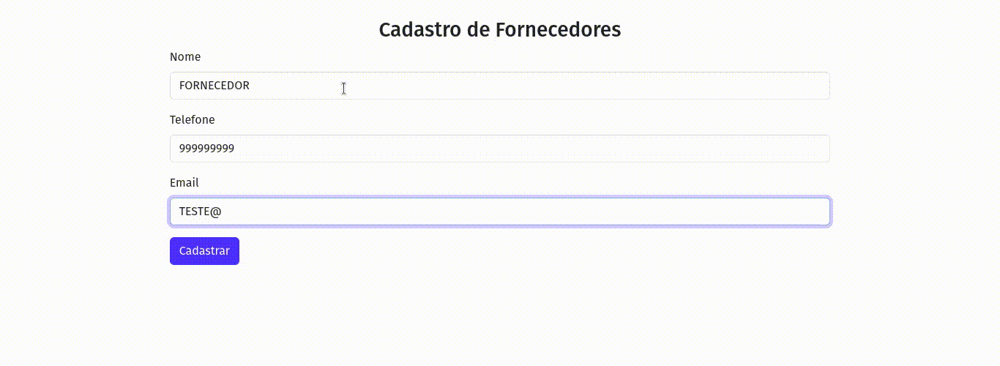

Instruções:

- Com a aplicação desenvolvida durante a semana.

- Utilizando o ORM Sequelize, crie um model chamado fornecedor.js dentro da pasta models.

- Crie o model fornecedor com os seguintes campos:
    - id: tipo int restrição primary key;
    - nome: tipo string;
    - telefone: tipo string;
    - email: tipo string;
- Crie o formulário para inserção dos campos do fornecedor chamado formFornecedor.html dentro da pasta views com os campos para inserção dos dados do fornecedor. O action do formulário deve ser /addfornecedor e method="post"
- No arquivo index.js, crie a rota POST para a operação create (criar) registros na tabela fornecedor.

## Projeto em execução

